  

  
  
  

 

<!-- ─────────────────────────────  WHOAMI  ───────────────────────────── -->

<h3><code>kymani@github ~ $ whoami</code></h3>

<table>
<tr>

<td width="45%" valign="top" align="center">

</td>

<td width="55%" valign="top">

- 💻 **Full-Stack Software Engineer** building scalable applications for Fortune 500 companies.
- ☁️ Cloud Data Engineering intern at **The J.M. Smucker Co.** — AWS Glue, Lambda, CI/CD with OIDC keyless auth.
- 🛠️ Full-Stack Engineer at the **UC IT Solutions Center** — React, Node/TypeScript, C#, PostgreSQL.
- 🎓 Third-year double B.S. in **Information Technology** + **Cybersecurity** at the University of Cincinnati.
- 🧱 Big on **Clean Architecture**, SOLID, and treating architecture as a handoff mechanism, not an aesthetic.
- 🌱 Currently deep in system design, observability tooling, and AI-assisted developer workflows.
- 🇯🇲 Kingston-born. Basketball, gym, and video editing when I'm not shipping.
- 🎯 Seeking **Summer 2027** SWE / Cloud Data Engineering internships.

</td>

</tr>
</table>

 

<!-- ─────────────────────────────  TECH STACK  ───────────────────────────── -->

<h2 align="center">💻 Tech Stack</h2>

  

 

<!-- ─────────────────────────────  ANALYTICS  ───────────────────────────── -->

<h2 align="center">📈 GitHub Analytics</h2>

  
  

  

  

 

<!-- ─────────────────────────────  SNAKE  ───────────────────────────── -->

<h2 align="center">🐍 Contribution Graph</h2>

  <picture>
    <source media="(prefers-color-scheme: dark)" srcset="https://raw.githubusercontent.com/kymanirjarrett/kymanirjarrett/output/github-snake-dark.svg" />
    <source media="(prefers-color-scheme: light)" srcset="https://raw.githubusercontent.com/kymanirjarrett/kymanirjarrett/output/github-snake.svg" />
    
  </picture>

<!--
  The snake SVGs are generated daily by .github/workflows/snake.yml (Platane/snk)
  and committed to the `output` branch. They will 404 until that workflow runs once.
-->

 

<!-- ─────────────────────────────  PROJECTS  ───────────────────────────── -->

<h2 align="center">🚀 Featured Projects</h2>

<table align="center">
<tr>
<td width="50%" valign="top">

### 🛰️ [Vigil](https://github.com/kymanirjarrett/vigil)
ETL monitoring and observability platform for AWS Glue pipelines. Anomaly detection on job duration and consecutive failures, RBAC, append-only audit logging, and a real-time security posture dashboard.

`FastAPI` `React` `PostgreSQL` `boto3` `Supabase`

</td>
<td width="50%" valign="top">

### 📄 Clausify
AI-powered legal contract analysis for freelancers. Clause-level risk scoring with jurisdiction-aware prompt construction and structured JSON output backed by pgvector.

`Next.js` `TypeScript` `Supabase` `pgvector` `Groq`

</td>
</tr>
</table>

 

<!-- ─────────────────────────────  CONNECT  ───────────────────────────── -->

<h2 align="center">🌐 Let's Connect</h2>

  

  

